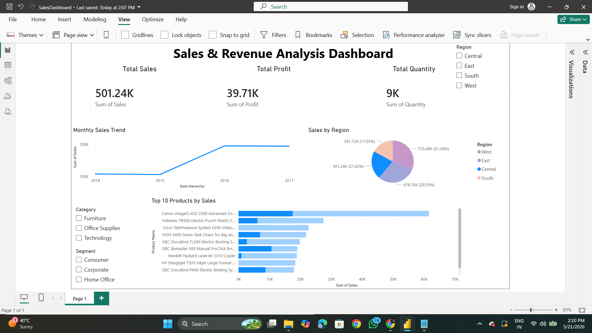

# Sales & Revenue Analysis Dashboard

## Project Overview
This project is an interactive Sales & Revenue Analysis Dashboard developed using Microsoft Power BI.

The dashboard helps analyze:
- Sales performance
- Profit trends
- Quantity analysis
- Regional performance
- Top-performing products

## Tools Used
- Microsoft Power BI
- Superstore Dataset
- Data Visualization Techniques

## Dashboard Features
- KPI Cards
- Monthly Sales Trend
- Sales by Region Pie Chart
- Top 10 Products Analysis
- Interactive Filters

## Dashboard Preview

## Files Included
- SalesDashboard.pbix
- Sales_Report.pdf
- Dataset
- Screenshots

## Author
Tanishka
